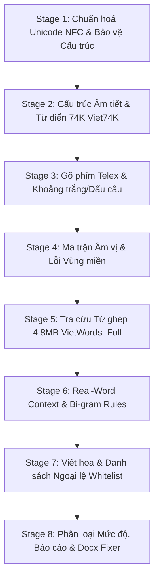

# Vietnamese Offline Spell Check — 8-Stage Pure Algorithmic Pipeline (Zero-AI)

Pipeline kiểm tra và sửa lỗi chính tả tiếng Việt **100% OFFLINE thuần thuật toán (Zero-AI, tốc độ ~0.05s)**, không phụ thuộc internet, không dùng LLM/GPU, bảo mật dữ liệu tuyệt đối và tích hợp cơ chế cập nhật dữ liệu tự học theo từng giai đoạn.

---

## 📝 Lịch Sử Thay Đổi (Revision History)

| Phiên bản | Ngày | Tác giả | Các Điểm Thay Đổi Chính (Key Changes / Delta) | Trạng thái |
|---|---|---|---|---|
| **v4.0.0** | Cũ | System | Pipeline 7 giai đoạn có sử dụng DeepSeek Cloud & Ollama LLM | `SHIPPED` |
| **v5.1.0** | Cũ | System | Rút gọn 5 giai đoạn offline cơ bản + cơ chế hỏi ý kiến cập nhật 4 file | `SHIPPED` |
| **v6.0.0** | 2026-09-16 | Agent | Nâng cấp toàn diện lên **8 Giai Đoạn Thuần Thuật Toán (Zero-AI)** siêu chặt chẽ: Chuẩn hoá Unicode NFC, kiểm tra âm tiết 74K, ma trận âm vị, đối soát kho từ ghép 4.8MB `VietWords_Full`, N-gram Real-word, phân loại Severity và tạo Slash Command `/chinhta` | `SHIPPED` |

---

## 🔄 Quy Trình 8 Giai Đoạn Thuần Thuật Toán (Zero-AI Pipeline)



| Giai đoạn | Tên Giai Đoạn | Cơ Chế Xử Lý Kỹ Thuật (Pure Algorithms) | Tệp Dữ Liệu Liên Quan |
|---|---|---|---|
| **STAGE 1** | **UNICODE & SANITIZATION** | Chuẩn hoá Unicode NFC (`hoà` ↔ `hòa`), tách token câu/từ. Bảo vệ URL, Email, số liệu, code tag để chống bắt nhầm. | Thuật toán `unicodedata.normalize` |
| **STAGE 2** | **SYLLABLE & 74K DICT** | Tra cứu HashSet âm tiết chuẩn trong `Viet74K.txt` + `custom_words.txt`. Kiểm tra cấu trúc âm vị học tiếng Việt (phụ âm đầu + vần + thanh). | `scripts/Viet74K.txt`<br>`scripts/custom_words.txt` |
| **STAGE 3** | **TYPOGRAPHY & TELEX** | Regex bắt lỗi gõ phím: phụ âm lặp (`nngẫm`), nguyên âm lặp, gõ dính chữ (`vàngchạy`), dính dấu (`người,ta`), gõ lệch phím Telex/VNI (`sra`, `ghĩ`). | `scripts/custom_typing_rules.json` |
| **STAGE 4** | **PHONETIC CONFUSION MATRIX** | Ma trận âm vị đối soát 8 nhóm lỗi vùng miền: `tr/ch`, `s/x`, `d/gi/r`, `l/n`, `v/d`, âm cuối `t/c`, `n/ng`, `m/ng`, và cặp nhầm thanh `hỏi (?) / ngã (~)`. | `scripts/confusable_pairs.py`<br>`scripts/custom_phonetic_rules.json` |
| **STAGE 5** | **COMPOUND & IDIOMS DICT** | Đối soát kho dữ liệu khổng lồ 4.8MB `VietWords_Full.txt` và `VietDictionary_Master.txt` để bắt lỗi sai từ ghép, từ láy, quán ngữ (`chia sẽ`→`chia sẻ`, `sát nhập`→`sáp nhập`, `xát sao`→`sát sao`). | `scripts/VietWords_Full.txt`<br>`scripts/VietDictionary_Master.txt` |
| **STAGE 6** | **REAL-WORD CONTEXT (N-gram)** | Thuật toán N-gram (Bi-gram/Tri-gram) phát hiện từ đúng từ điển nhưng sai ngữ cảnh câu (`khôn`→`không`, `tra`→`trang`, `sốt suột`→`sốt ruột`, `khăn xuông`→`khăn vuông`). | `scripts/custom_confusable_pairs.json` |
| **STAGE 7** | **CAPITALIZATION & WHITELIST** | Quy tắc viết hoa (đầu câu, địa danh, tên riêng) và bộ lọc Whitelist từ mượn ngoại nhập phổ biến (`Facebook`, `Vercel`, `API`, `laptop`, `carton`). | `scripts/confusable_pairs.py` (`LOANWORD_WHITELIST`) |
| **STAGE 8** | **SEVERITY, REPORT & FIXER** | Đánh giá mức độ nghiêm trọng (High / Medium / Low). Xuất báo cáo `spelling_report.md` và tự động áp dụng sửa trực tiếp vào file `.docx`/`.txt` bảo toàn định dạng. | `spelling_report.md` |

---

## 🛑 Cơ Chế Tự Học & Xác Nhận Cập Nhật Dữ Liệu (Self-Improving Gate)

Sau khi hoàn thành **STAGE 8**, Agent tự động gom các phát hiện mới và hỏi người dùng:

1. **Phân loại mục mới gom được**:
   - Thuật ngữ chuyên ngành / Tên riêng mới → Đề xuất nạp vào `custom_words.txt` (Stage 2).
   - Mẫu lỗi gõ phím mới → Đề xuất nạp vào `custom_typing_rules.json` (Stage 3).
   - Mẫu lỗi vùng miền mới → Đề xuất nạp vào `custom_phonetic_rules.json` (Stage 4).
   - Cặp từ nhầm ngữ cảnh mới → Đề xuất nạp vào `custom_confusable_pairs.json` (Stage 6).
2. **Hỏi người dùng xác nhận**:
   *"Bạn có muốn lưu các từ/quy tắc mới trên vào bộ dữ liệu local tương ứng không?"*
3. **Chỉ ghi tệp** khi người dùng đồng ý trực tiếp trong chat ("OK", "Đồng ý", "Lưu").

---

## 🛠️ Chi Tiết Lệnh Thực Thi (100% Offline)

### Cách 1: Gõ Slash Command trong chat
```text
/chinhta đường_dẫn_file.docx
```

### Cách 2: Chạy trực tiếp qua Terminal (0.05s)
```bash
# 1. Rà soát kiểm tra và xuất báo cáo markdown:
python scripts/vn_spell_checker.py "duong_dan_file.docx" --mode offline

# 2. Tự động sửa lỗi và xuất ra file .docx mới:
python scripts/vn_spell_checker.py "duong_dan_file.docx" --mode offline --fix
```
